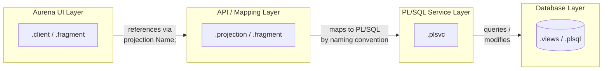

# IFS Marble Language Reference

IFS Cloud's development framework uses a proprietary declarative language informally called **Marble** (also seen as PLVC or MTG in tooling). You write it in IFS Developer Studio — the autocomplete sidebar is the closest thing to official docs. This vault is the reference that docs page should have been.

> [!info] Official Reference
> IFS maintains a thin portal at [developer.ifs.com — Syntax & Reference Overview](https://developer.ifs.com/assets/pages/devstudioreference/SyntaxReferenceOverview.htm). The deep sub-pages require an IFS-approved browser session. This vault expands those stubs with annotated real-world examples drawn from IFS's own SHPORD (Shop Order) module source.

---

## Architecture Overview

Every IFS Cloud screen involves at least three layers. Understanding which file belongs at which layer is the foundation of reading and writing Marble.



---

## File Types Quick Reference

| Extension | Layer | Purpose |
|-----------|-------|---------|
| `.client` | Aurena UI | Pages, navigator entries, lists, groups, dialogs, assistants |
| `.fragment` | Both | Reusable UI + projection constructs in one file |
| `.projection` | API | Entitysets, entities, queries, virtuals, actions, functions |
| `.plsvc` | Service | Oracle PL/SQL implementations behind projection actions/functions |
| `.plsql` | Database | PL/SQL packages (LU APIs, utilities) |
| `.views` | Database | Database view definitions |
| `.entity` | Entity | Entity metadata (Base layer only) |

---

## Layer System

Every file declares its ==layer==. This controls merge precedence and deployment scope:

| Layer | Used for |
|-------|----------|
| `Core` | IFS-supplied base code — never edit directly |
| `Cust` | Customer customizations — your work goes here |
| `Cus2`–`CusN` | Additional customer layers for multi-tenant scenarios |
| `Test` | Test and sandbox code |

A `Cust` layer file with `@Override` can extend or replace a `Core` entity without touching the original.

---

## Start Here

New to IFS Cloud development? Follow this path in order.

1. [[Thinking in Marble]] — the mental model: how the four layers relate, the three rules, and how to approach building a screen
2. [[Glossary]] — definitions for every term used in this vault, with equivalents from React, SQL, and REST
3. [[Build Your First Screen]] — step-by-step tutorial: build a working list page, form, LOV, badge, and command from scratch
4. [[Common Patterns]] — 18 named recipes for the scenarios that come up in almost every screen

---

## Notes in This Vault

### Projection Layer

```dataview
TABLE aliases, tags
FROM #ifs-marble/projection
SORT file.name ASC
```

### Client / Aurena UI Layer

```dataview
TABLE aliases, tags
FROM #ifs-marble/client
SORT file.name ASC
```

---

## How Projection and Client Relate

A `.client` file declares `projection <Name>;` at the top — it consumes exactly one projection. The projection defines the ==data contract== (what entities exist, what attributes they have, what actions are callable). The client defines the ==presentation== (how to display that data in Aurena).

A `.fragment` file is the exception: it contains **both** a `CLIENT FRAGMENTS` section (UI constructs) and a `PROJECTION FRAGMENTS` section (data constructs) in one file. It is included in both the parent `.client` and `.projection` via `include fragment <Name>;`.

---

## See Also

- [[Projection File Structure]] — start here for server-side development
- [[Client File Structure]] — start here for Aurena UI development
- [[Fragment]] — how fragments bridge both layers
- [[Entity]] — the most commonly extended construct
- [[Virtual]] — for dialogs and assistants that don't map to a real table

### Client / Aurena UI — Key Concept Notes

- [[Property Index]] — **alphabetical reference of every client property** with type, default, and which controls it applies to
- [[Emphasis and Colors]] — the color/theming system used by nearly every visual control
- [[Layout Controls]] — Arrange, Section, Fieldset, Tabset, GroupingFieldset
- [[Display Controls]] — Badge, Boolean, State Indicator, Computed Field, Static Field, Markdown Text, Progress Field
- [[Input Controls]] — Currency/Measure, Date Range, Date Time Picker, Color Picker, Radio Group, Rating, Item Picker, Address, Signature
- [[Card and Sheet]] — card templates for Card View, Calendar popups, and Tree Diagram nodes
- [[Charts]] — Bar, Line, Pie, and Funnel charts
- [[Data Views]] — Calendar, Timeline, Gantt Chart, Tree, Tree Diagram, Box-matrix
- [[Selector and Search Context]] — search panels and page-level record selectors
- [[Utility Controls]] — Process Viewer, Toast, Message Box, Contact Widget

---

## Base Server Layer

The Marble/projection layer sits on top of the Base Server layer. See the [[Base Server Reference/README|Base Server Reference]] for documentation on the underlying entities and PL/SQL layer that projections map to:

- [[Entity (Base Server)]] — Logical Unit model (`.entity` files, stored as XML)
- [[Attribute Control Flags]] — decoding AMIUL, KMI-L, A-IUL etc.
- [[Enumeration (Base Server)]] — fixed-value code sets (`.enumeration` files)
- [[Utility (Base Server)]] — stateless PL/SQL utility packages
- [[Overview Diagram]] — the visual entity relationship diagram (`.overview` files)
- [[PL-SQL Annotations]] — @Override, @Final, @SecurityCheck etc.
