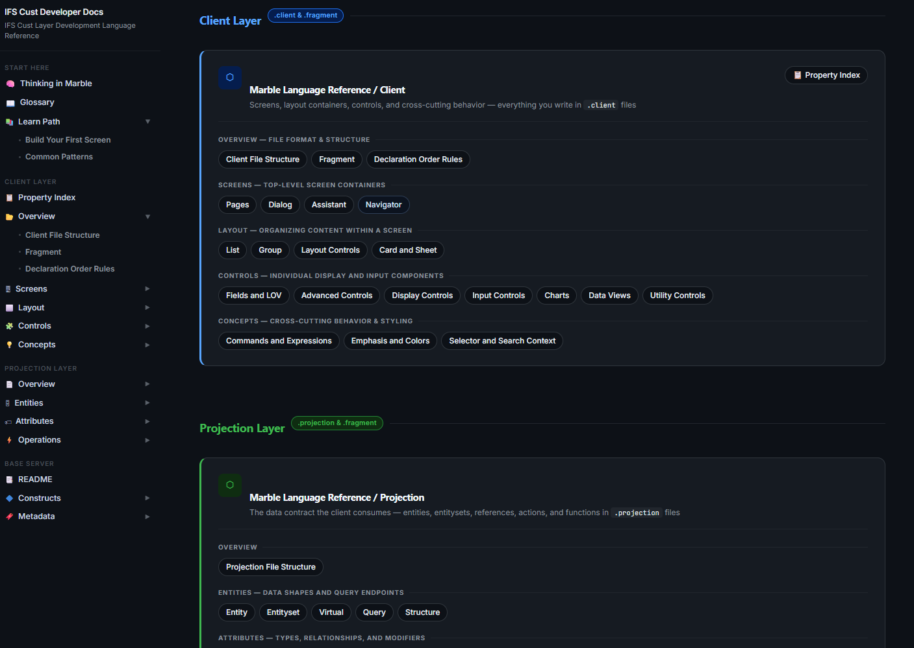

# 📚 IFS Cust Developer Docs

### Customer-focused, always-editable documentation for IFS Cloud `-Cust` layer development

*Fill the gaps IFS's own docs leave open — explained by comparison to languages and patterns you may already know.*

📖 [**Read the Docs**](https://phbronson999.github.io/ifs-dev-docs/)
---

## 🎯 What's Covered

This isn't just a Marble reference — it spans everything a customer developer runs into at the `-Cust` layer:

- 🧠 **Marble** (`.client` / `.projection`) — screens, layout, controls, entities, attributes, actions & functions
- 🔷 **Base Server** — entities, enumerations, utilities, PL/SQL annotations
- 📊 **Analytics** — Lobby, Tabular Model (analysis/dimension/fact/filter models)
- 🗂 **Other model types** — Business Object, Database Change, Mobile App, Outbound, Portlet, Scheduling, Searchdomain, Server Package, Test Case, Transformer, Webservice

**Scope:** only the **`-Cust` layer** — the customization layer where customer-written code lives. IFS's own Core/base layer development isn't covered.

**Not covered (yet):** more advanced topics like plugins and Java are largely out of scope for now.

## 🤖 Where This Comes From

Some of this content was gathered using the **[IFS Cloud MCP VS Code Extension](https://marketplace.visualstudio.com/items?itemName=IFS.ifsclouddevelopmentkit)**, which gives AI coding agents an MCP (Model Context Protocol) server with deep knowledge of the IFS Cloud codebase. Where that's the case, the content was produced by AI agents querying that MCP server, not hand-written from personal experience. The rest comes from experience and reading between the lines of IFS's own documentation.

For the official, authoritative source, always defer to:
- 📘 [IFS TechDocs](https://docs.ifs.com/techdocs)
- 🌐 [IFS Developer Portal](https://developer.ifs.com/)

## 🚧 Status

This is a **work in progress**. Some explanations, examples, or opinions here may be incomplete or outright wrong — they'll be corrected as they're found. The goal isn't to be authoritative; it's to fill in real gaps that customer developers hit at every skill level, using whatever's actually been useful in practice. See [TODO.md](TODO.md) for known issues.

## ⚠️ Disclaimer

This project is **not affiliated with, endorsed by, or sponsored by IFS AB or IFS Cloud**. "IFS", "IFS Cloud", "Marble", and related terms are used solely to describe compatibility with that language/product; all related trademarks belong to their respective owners.